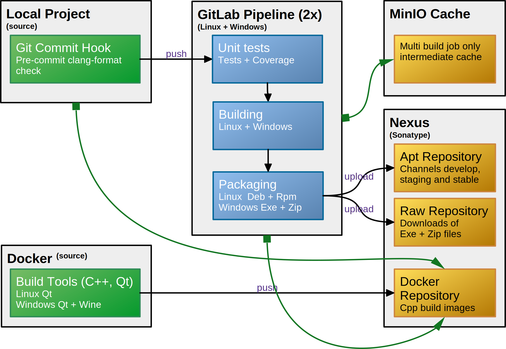
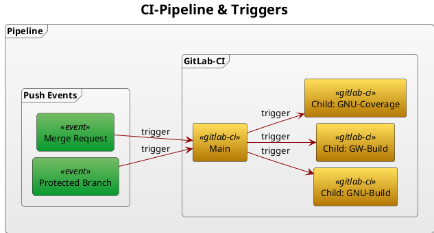

# GitLab DevOps Template Project/Repository

## Content

<!-- TOC -->
* [GitLab DevOps Template Project/Repository](#gitlab-devops-template-projectrepository)
  * [Content](#content)
  * [Introduction](#introduction)
  * [GitHub Cloning](#github-cloning)
  * [Docker C++ Build Image](#docker-c-build-image)
  * [The C++ Application Source](#the-c-application-source)
    * [Applications & Library](#applications--library)
    * [CMake Generic C++ Support Library](#cmake-generic-c-support-library)
      * [Catch2 Unittests](#catch2-unittests)
      * [Doxygen Manual/Document Generator](#doxygen-manualdocument-generator)
      * [Code Format Checking with Clang](#code-format-checking-with-clang)
      * [Build Script](#build-script)
  * [CI/CD Pipeline Configuration](#cicd-pipeline-configuration)
  * [MinIO Cache Server](#minio-cache-server)
  * [Sonatype Nexus](#sonatype-nexus)
  * [GitLab-Runner with Docker](#gitlab-runner-with-docker)
  * [CLion IDE Docker Integration](#clion-ide-docker-integration)
* [Gitlab Issues](#gitlab-issues)
  * [Child Coverage Report](#child-coverage-report)
* [CLion Issues](#clion-issues)
  * [Toolchain Docker running GDB (not working)](#toolchain-docker-running-gdb-not-working)
<!-- TOC -->

## Introduction

This project is to test GitLab's CI/CD-pipeline with a **hello-world** C++ applications.
One for console and one for GUI using the Qt-framework.
Both applications are build for Linux and also for Windows using a MinGW cross-compiler
on Linux including the Catch2 unittest-framework.

The application has a shared library and is build using CMake and presets and a build script
to simplify pipeline configurations for building,
testing and packaging. The Gitlab-Runners use Docker containers for builds and the runner
is also a container itself. Runners are using a self-hosted caching service/server for
caching between jobs across different hosts machines/containers.

The used Docker containers are stored on a self-hosted Docker-repository and deployment on a
self-hosted apt-repository and for Windows a raw-repository.



Links:

* [GitLab](https://about.gitlab.com/)
* [CMake](https://cmake.org/)
* [Qt-Framework](https://www.qt.io/product/framework)
* [Doxygen](https://www.doxygen.nl/)
* [Docker](https://www.docker.com/)
* [MinIO](https://min.io/)
* [Sonatype Nexus](https://www.sonatype.com/)
* [CLion](https://www.jetbrains.com/clion/)

Repositories:

* [sf-docker-runner](https://github.com/Scanframe/sf-docker-runner)`
* [sf-cmake](https://github.com/Scanframe/sf-cmake)
* [Catch2](https://github.com/catchorg/Catch2)

## GitHub Cloning

Since the GitHub repository is a mirror from a private GitLab server the `.gitmodule` file needs to be changed.  
The script [github-clone.sh](github-clone.sh "Link to script.") facilitates this.s

Execute the script when downloading.

```shell
wget "https://raw.githubusercontent.com/Scanframe/sf-gitlab-devops/main/github-clone.sh" -qO - | bash
```

## Docker C++ Build Image

The Docker image used for the CI/CD-pipeline en also for compiling in [CLion](https://www.jetbrains.com/clion/) is configured
by the in the GitHub [`sf-docker-runner`](https://github.com/Scanframe/sf-docker-runner) repository bash script `cpp-builder.sh` and `cpp-builder/Dockerfile`.  
The bash-script assembles all files needed to create this monster of an image of 2.8 GByte and push it to the self-hosted
[Sonatype Nexus server](https://nexus.scanframe.com/#browse/browse:docker-image:v2/gnu-cpp/tags/dev).

Execute the script `cpp-builder.sh` and view its sub-commands.

```shell
./cpp-builder.sh --help
```

```
Executes CMake commands using the 'CMakePresets.json' and 'CMakeUserPresets.json' files
of which the first is mandatory to exist.

Usage: build.sh [<options>] [<presets> ...]
  -h, --help       : Shows this help.
  -d, --debug      : Debug: Show executed commands rather then executing them.
  -i, --info       : Return information on all available build, test and package presets.
  -s, --submodule  : Return branch information on all Git submodules of last commit.
  -p, --package    : Create packages using a preset.
  --required <trg> : Install required packages using the package manager under Linux.
                     For Windows package managers apt-cyg (Cygwin) and WinGet are used.
                     Where <trg> is the targeted system to build for like 'lnx', 'win', 'arm' on Linux
                     and for Windows only 'win'.
  -m, --make       : Create build directory and makefiles only.
  -f, --fresh      : Configure a fresh build tree, removing any existing cache file.
  -C, --wipe       : Wipe clean build tree directory by removing all contents from the build directory.
  -c, --clean      : Cleans build targets first (adds build option '--clean-first')
  -b, --build      : Build target and make config when it does not exist.
  -B, --build-only : Build target only and fail when the configuration does note exist.
  -t, --test       : Runs the ctest application using a test-preset.
  -r, --regex      : Regular expression on which test names are to be executed.
  -w, --workflow   : Runs the passed work flow presets.
  -l, --list-only  : Lists the ctest test defined application by the project and selected preset.
  -n, --target     : Overrides the build targets set in the preset by a single target.
  Where <sub-dir> is the directory used as build root for the CMakeLists.txt in it.
  This is usually the current directory '.'.
  When the <target> argument is omitted it defaults to 'all'.
  The <sub-dir> is also the directory where cmake will create its 'cmake-build-???' directory.

  Examples:
    Get all project presets info: ./build.sh -i
    Make/Build project: ./build.sh -b my-build-preset1 my-build-preset2
    Test project: ./build.sh -t my-test-preset1 my-test-preset2
    Make/Build/Test/Pack project: ./build.sh -w my-workflow-preset
```

The image contains all needed packages for builds and each of them are listed here with their versions.

The next list is obtained by executing `./docker-build.sh versions`.

```text
Docker image used: nexus.scanframe.com/amd64/gnu-cpp:24.04-6.7.2:
Application     Version
Ubuntu          24.04
Git             2.47.1
GCC             13.3.0
C++             13.3.0
GCC-13          13.3.0
C++-13          13.3.0
MinGW GCC       13-posix
MinGW C++       13-posix
CMake           3.31.2
GNU-Make        4.3
Ninja-Build     1.11.1
CLang-Format    20.0.0
Gdb             15.0.50.20240403-git
GNU-Linker      2.42
DoxyGen         1.9.8
Graphviz        2.43.0
Exif-Tool       12.76
Dpkg            1.22.6
RPM             4.18.2
OpenJDK         21.0.5
BindFS          1.14.7
Fuse-ZIP        0.6.0
JQ              1.7
Gcovr           8.2
Python3         3.12.3
Wine            9.0
Wine > Windows  10.0.19043
```
## The C++ Application Source

### Applications & Library

The application source is located in this repository.  
The generic '**hello-world**' console application in [`gen/main.cpp`](./src/gen/main.cpp).  
The Qt cross-platform '**hello-world-qt**' GUI-application in [`qt/main.cpp`](./src/qt/main.cpp).  
The cross-platform '**hello-lib**' shared/dynamic/library in [`hwl/src/main.cpp`](./src/hwl/src/hello.cpp).

### CMake Generic C++ Support Library

The CMake Linux package contains more than the `cmake` executable.

| App   | Description                                                                                                                                                                                                                                                                                  |
|-------|----------------------------------------------------------------------------------------------------------------------------------------------------------------------------------------------------------------------------------------------------------------------------------------------|
| CMake | CMake is an open-source, cross-platform build system. It uses configuration files (CMakeLists.txt) to generate native build scripts for various platforms and compilers. CMake simplifies the build process by providing a consistent interface for managing complex build configurations.   |
| CTest | CTest is a testing tool that integrates with CMake. It allows developers to define and run tests for their CMake-based projects. CTest can execute tests in parallel, generate test reports, and integrate with Continuous Integration (CI) systems for automated testing.                   |
| CPack | CPack is a packaging tool designed to create distribution packages for software projects built with CMake. It can generate package formats such as DEB, RPM, NSIS, and ZIP. CPack simplifies the process of creating installable packages for different operating systems and distributions. |

To allow reuse of scripts for the ease of usage a library [sf-cmake](https://github.com/Scanframe/sf-cmake) is created and used as a Git-submodule.

#### Catch2 Unittests

To make it more challenging the **Catch2** unit-test library is imported.
The test application sources are located in [`./src/tests`](./src/tests).

```cmake
# FetchContent added in CMake 3.11, downloads during the configure step.
include(FetchContent)
# Import Catch2 library for testing.
FetchContent_Declare(
	Catch2
	GIT_REPOSITORY https://github.com/catchorg/Catch2.git
	GIT_TAG v3.1.1
)
# Adds Catch2::Catch2
FetchContent_MakeAvailable(Catch2)
```

#### Doxygen Manual/Document Generator

The `cmake/lib/SfDoxygenConfig.cmake` package adds a function `Sf_AddDoxygenDocumentation()` which in its turn adds a manual target.

Look at [Doxygen](https://www.doxygen.nl/) website for the syntax in C++ header comment blocks or Markdown files.

```cmake
# Required first entry checking the cmake version.
cmake_minimum_required(VERSION 3.25)
# Set the global project name.
project("doc")
# Add doxygen project when SfDoxygen was found.
# On Windows this is only possible when doxygen is installed in Cygwin.
find_package(SfDoxygen QUIET)
if (SfDoxygen_FOUND)
	# Get the markdown files in this project directory including the README.md.
	file(GLOB _SourceList RELATIVE "${CMAKE_CURRENT_BINARY_DIR}" "*.md" "../*.md")
	message("${_SourceList}")
	# Get all the header files from the application.
	file(GLOB_RECURSE _SourceListTmp RELATIVE "${CMAKE_CURRENT_BINARY_DIR}" "../app/*.h" "../app/*.md")
	# Remove unwanted header file(s) ending on 'Private.h'.
	list(FILTER _SourcesListTmp EXCLUDE REGEX ".*Private\\.h$")
	# Append the list with headers.
	list(APPEND _SourceList ${_SourceListTmp})
	# Adds the actual manual target.
	Sf_AddDoxygenDocumentation("${PROJECT_NAME}" "${PROJECT_SOURCE_DIR}" "${PROJECT_SOURCE_DIR}/../bin/man" "${_SourceList}")
endif ()
```

#### Code Format Checking with Clang

To enable format check before a commit modify or add the script `.git/hooks/pre-commit` with the following content.
It calls the [check-format.sh](./check-format.sh) script which in directly calls
the [`clang-format.sh`](https://github.com/Scanframe/sf-cmake/blob/main/bin/clang-format.sh) script
from the CMake support library. It also checks if it is a commit to the main or master branch and prevents it.

```bash
#!/bin/bash

# Redirect output to stderr.
exec 1>&2
# Get the branch name.
branch="$(git rev-parse --abbrev-ref HEAD)"
# Check if it is 'main' and prevent a commit on it.
if [[ "${branch}" == "main" || "${branch}" == "master" ]]; then
	echo "You can't commit directly to the '${branch}' branch!"
	exit 1
fi

# When the file 'check-format.sh' exists call it to check if the formatting is correct.
if [[ -f check-format.sh ]]; then
	if ! ./check-format.sh; then
		echo "Source is not formatted correctly!"
		exit 1
	fi
fi
```

This same script is used in the main pipeline configuration script [`main.gitlab-ci.yml`](.gitlab/main.gitlab-ci.yml)
in the job named '**check-env**'.  
So when the format is incorrect the pipeline will fail.

#### Build Script

The [`./build.sh`](build.sh) script make a call to the CMake support library bash-script [`Build.sh`](https://github.com/Scanframe/sf-cmake/blob/main/bin/Build.sh).

```
Executes CMake commands using the 'CMakePresets.json' and 'CMakeUserPresets.json' files
of which the first is mandatory to exist.

Usage: cmake/lib/bin/Build.sh [<options>] [<presets> ...]
  -h, --help       : Shows this help.
  -d, --debug      : Debug: Show executed commands rather then executing them.
  -i, --info       : Return information on all available build, test and package presets.
  -s, --submodule  : Return branch information on all Git submodules of last commit.
  -p, --package    : Create packages using a preset.
  --required       : Install required Linux packages using debian apt package manager.
  -m, --make       : Create build directory and makefiles only.
  -f, --fresh      : Configure a fresh build tree, removing any existing cache file.
  -C, --wipe       : Wipe clean build tree directory by removing all contents from the build directory.
  -c, --clean      : Cleans build targets first (adds build option '--clean-first')
  -b, --build      : Build target and make config when it does not exist.
  -B, --build-only : Build target only and fail when the configuration does note exist.
  -t, --test       : Runs the ctest application using a test-preset.
  -w, --workflow   : Runs the passed work flow presets.
  -l, --list-only  : Lists the ctest test defined application by the project and selected preset.
  -n, --target     : Overrides the build targets set in the preset by a single target.
  -r, --regex      : Regular expression on which test names are to be executed.
  Where <sub-dir> is the directory used as build root for the CMakeLists.txt in it.
  This is usually the current directory '.'.
  When the <target> argument is omitted it defaults to 'all'.
  The <sub-dir> is also the directory where cmake will create its 'cmake-build-???' directory.

  Examples:
    Get all project presets info: /mnt/server/userdata/source/c++src/trial-devops/cmake/lib/bin/Build.sh -i
    Make/Build project: /mnt/server/userdata/source/c++src/trial-devops/cmake/lib/bin/Build.sh -b my-build-preset1 my-build-preset2
    Test project: /mnt/server/userdata/source/c++src/trial-devops/cmake/lib/bin/Build.sh -t my-test-preset1 my-test-preset2
    Make/Build/Test/Pack project: /mnt/server/userdata/source/c++src/trial-devops/cmake/lib/bin/Build.sh -w my-workflow-preset
```

To make it easy to run the same commands within the Docker builder image,
the [`docker-build.sh`](./docker-build.sh) is provided which takes the same arguments as the `build.sh` script.

```
Same as 'build.sh' script but running from Docker image but allows Docker specific commands.

Usage: docker-build.sh <options> -- <build-options> [command] <args...>

  Options:
    -h, --help                : Shows this help.
    --qt-ver <version>        : Qt version part forming the Docker image name which defaults to '6.7.2' but empty is possible.
    -p, --platform <platform> : Platform part forming the Docker image which defaults to 'amd64' where available is 'amd64' and 'arm64'.
    --no-build-dir            : Docker project builds in a regular cmake-build directory as a native build would.

  Commands:
    pull      : Pulls the docker image from the Docker registry.
    run       : Runs a command as user 'user' in the container using Docker command.
                'run' or 'exec' depending on a running container in the background.
    start     : Starts/Detaches a container named 'cpp_builder' in the background.
    attach    : Attaches to the  in the background running container named 'cpp_builder'.
    status    : Returns info of the running container 'cpp_builder' in the background.
    stop      : Stops the container named 'cpp_builder' running in the background.
    kill      : Kills the container named 'cpp_builder' running in the background.
    versions  : Shows versions of most installed applications within the container.
    sshd      : Starts sshd service on port 3022 to allow remote control.

  When a the container is detached it executes the 'build.sh' script by attaching to the container which is much faster.

  Examples:
    Show the targets using the amd64 platform docker image and Qt version 6.7.2.
      docker-build.sh --platform amd64 --qt-ver 6.7.2 -- --info
      docker-build.sh --platform arm64 --qt-ver '' -- run uname -a
```

## CI/CD Pipeline Configuration

The CI/CD Pipeline configuration has a main [`main.gitlab-ci.yml`](.gitlab/main.gitlab-ci.yml) file which triggers a  
child-pipeline [`build-single.gitlab-ci.yml`](.gitlab/main.gitlab-ci.yml) twice.  
Respectively **Linux** and **Windows** but having different variable assignments passed from the main pipeline.  
The [`coverage.gitlab-ci.yml`](.gitlab/coverage.gitlab-ci.yml) is triggert once. 

The `SF_SIGNAL` variable is set in GitLab for the project.

| Value  | Description                                                                            |
|--------|----------------------------------------------------------------------------------------|
| skip   | Do not trigger any pipelines.                                                          |
| test   | Tests the caching and artifacts mechanism.                                             |
| deploy | Allows testing manual deployment of packages where child pipelines are manual as well. |
|        | When left empty or not defined the pipeline runs normal.                               |



## MinIO Cache Server

The Docker way is to use image `minio-server` and `minio-mc` respectively for service and control console.  
For using Docker a script [`minio.sh`](https://github.com/Scanframe/sf-docker-runner/blob/main/minio.sh) is created to simplify it in
the [`sf-docker-runner`](https://github.com/Scanframe/sf-docker-runner) repository.  
To install a MinIO service from scratch using a Debian package is described in
the [wiki-page](https://wiki.scanframe.com/en/Configuration/Linux/minio-installation).

## Sonatype Nexus

To configure an APT-repository on a Sonatype Nexus server is described in
this [wiki-page](https://wiki.scanframe.com/en/Configuration/Linux/nexus-apt-hosted-repo "Link to Scanframe WikiJS.").  
For uploading files to a Nexus repository is the [`upload-nexus.sh`](cmake/lib/bin/upload-nexus.sh) script.

## GitLab-Runner with Docker

To run a GitLab-Runner service using Docker use image `gitlab/gitlab-runner:latest`.  
For using Docker a script [`gitlab-runner.sh`](https://github.com/Scanframe/sf-docker-runner/blob/main/gitlab-runner.sh) is created.
The script sets all the needed Docker options required by the 'C++ Build Image' (`gnu-cpp:dev`) to
have fuse available for `bindfs` `fuze-zip` and mounting it in the [`sf-docker-runner`](https://github.com/Scanframe/sf-docker-runner) repository.

## CLion IDE Docker Integration

For CLion add a Docker toolchain where the image to use is `gnu-cpp:dev` when it was build locally
or for example `nexus.scanframe.com/gnu-cpp:dev` when it was build remote and uploaded
to the self-hosted Nexus service.

The '**Docker**' toolchain '**Container Settings**' are as follows:

```
-u 0:0 
-e LOCAL_USER=1000:1000 
-e DISPLAY 
-v /home/<linux-username>/.Xauthority:/home/user/.Xauthority:ro 
--privileged 
--net host 
--rm
```

The volume mount for `.Xauthority` and `DISPLAY` environment variable is to allow
Qt GUI applications to use the host's X-server.  
Option `--privileged` is needed for it to use `fuse`.

# Gitlab Issues

## Child Coverage Report

Child pipelines cannot not report coverage, to enable this using can be done on the console.

> In GitLab [Issue](https://gitlab.com/gitlab-org/gitlab/-/issues/363557 "Issue link.") the feature
> can be enabled but seems not to work when tested at this moment.

**Enter the Console**

_This might take a while... a minute or so._

```shell
sudo gitlab-rails console
```

Paste the commands in the console when it started (prompt visible).

**Console Commands**

Enable the global feature.

```
Feature.enable(:ci_child_pipeline_coverage_reports)
```

The response is currently.

```text
WARNING: Understand the stability and security risks of enabling in-development features with feature flags.
See https://docs.gitlab.com/ee/administration/feature_flags.html#risks-when-enabling-features-still-in-development for more information.                                                                 
=> true
```

Check the status of the feature.

```
Feature.get(:ci_child_pipeline_coverage_reports)
```

Disable the feature.

```
Feature.disable(:ci_child_pipeline_coverage_reports)
```

# CLion Issues

## Toolchain Docker running GDB (not working)

It is not possible to run the GDB debugger from the IDE.  
Somehow the IDE is not able to communicate with GDB.  
The path of the binary file on the host is shown or passed to GDB.

/mnt/server/userdata/source/c++src/trial-devops/bin/lnx64/hello-world.bin

The configuration used by the Docker toolchain for this project is:

```
-u 0:0 
-e DISPLAY 
-v /home/arjan/.Xauthority:/home/user/.Xauthority:ro 
-v /mnt/server/userdata/source/c++src:/mnt/project 
--privileged 
--net host
--rm
```

