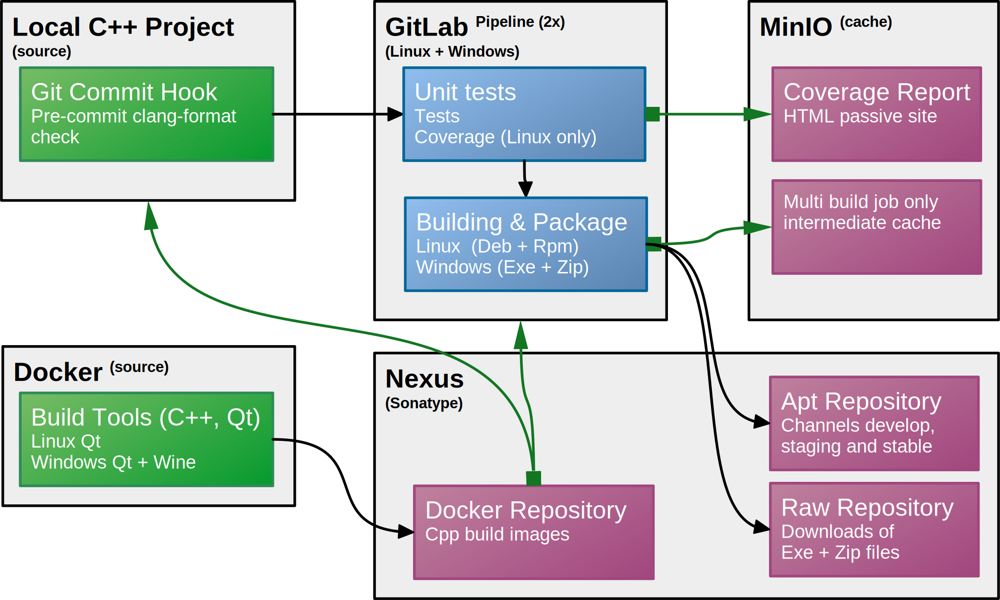

# C++/Qt DevOps Template Project

## Content

<!-- TOC -->
* [C++/Qt DevOps Template Project](#cqt-devops-template-project)
  * [Content](#content)
  * [Introduction](#introduction)
* [Project Development Methods](#project-development-methods)
  * [Command Line](#command-line)
  * [JetBrains IDEs](#jetbrains-ides)
  * [Cloning](#cloning)
    * [Cygwin on Windows Installation](#cygwin-on-windows-installation)
    * [Clone, Initialize, Build, Test & Package](#clone-initialize-build-test--package)
      * [Using: Linux Ubuntu 24.04 based OS](#using-linux-ubuntu-2404-based-os)
      * [Using: Linux Ubuntu 24.04 based OS crosscompiling Windows](#using-linux-ubuntu-2404-based-os-crosscompiling-windows)
      * [Using: Windows](#using-windows)
      * [Using: Docker on Any Linux x86_64](#using-docker-on-any-linux-x86_64)
  * [Docker Build Image](#docker-build-image)
    * [Available Prebuild Docker Images](#available-prebuild-docker-images)
  * [The C++ Application Source](#the-c-application-source)
    * [Applications & Library](#applications--library)
    * [CMake Generic C++ Support Library](#cmake-generic-c-support-library)
      * [Catch2 Unittests](#catch2-unittests)
      * [Doxygen Manual/Document Generator](#doxygen-manualdocument-generator)
      * [Code Format Checking with Clang-Format](#code-format-checking-with-clang-format)
      * [Build Script](#build-script)
  * [CI/CD Pipeline Configuration](#cicd-pipeline-configuration)
  * [MinIO Cache Server](#minio-cache-server)
  * [Sonatype Nexus](#sonatype-nexus)
  * [GitLab-Runner with Docker](#gitlab-runner-with-docker)
  * [CLion IDE](#clion-ide)
    * [Linux Native](#linux-native)
    * [Docker Image as Toolchain (Linux)](#docker-image-as-toolchain-linux)
    * [Docker Container access by JetBrains Gateway (SSH)](#docker-container-access-by-jetbrains-gateway-ssh)
  * [Gitlab Issues](#gitlab-issues)
    * [Child Coverage Report](#child-coverage-report)
<!-- TOC -->

## Introduction

This project is to test GitLab's CI/CD-pipeline with a **hello-world** and **hello-world-qt** C++ applications.
One for console and one for GUI using the Qt-framework.
Both applications are build for Linux x86_64, Linux aarch64 (cross-compiler) and Windows (cross-compiler).
The project includes Catch2 and GoogleTest unittest-frameworks.

The application has a shared library and is build using CMake and presets and a build script
to simplify pipeline configurations for building, testing and packaging.

The Gitlab-Runners use Docker containers for builds and the runner is also a container itself. 
Runners are using a self-hosted caching service/server (MinIO) for caching between jobs across 
different hosts machines/containers when build stages are separated in steps depending on the 
child pipeline configuration.

The used Docker containers are stored on a self-hosted Docker-repository and deployment on a
self-hosted apt-repository and for Windows a raw-repository.



Links:

* [GitLab](https://about.gitlab.com/)
* [CMake](https://cmake.org/)
* [Qt-Framework](https://www.qt.io/product/framework)
* [Doxygen](https://www.doxygen.nl/)
* [Docker](https://www.docker.com/)
* [MinIO](https://min.io/)
* [Sonatype Nexus](https://www.sonatype.com/)
* [CLion](https://www.jetbrains.com/clion/)

Repositories:

* [sf-docker-runner](https://github.com/Scanframe/sf-docker-runner)`
* [sf-cmake](https://github.com/Scanframe/sf-cmake)
* [Catch2](https://github.com/catchorg/Catch2)
* [GoogleTest](https://github.com/google/googletest)

# Project Development Methods

## Command Line

Building the project from the command line is available using the `./build.sh` shell script natively or from
within the Docker container (used also for the CI/CD pipelines).
To execute this script indirectly in a Docker container using the correct image and
options the `./docker-build.sh` shell script is devised and runs on Linux as well as Windows/Cygwin.

## JetBrains IDEs

Next is a table of all combination possible using JetBrains product for product development.  
Some of the next table columns and values explained:

* **CLI**: is Command Line Interface
* **IDE**: Integrated Development Environment
* **CLion**: [JetBrains C++ IDE](https://www.jetbrains.com/clion/)
* **Gateway**: [JetBrains Gateway](https://www.jetbrains.com/remote-development/gateway/) using CLion
* **OS**: Operating system
* **Arch**: Architecture of the build system.
* **Unittest**: Perform unitest (no debug) from the IDE.
* **Debug**: Debug from the IDE without additional configuration.
* **Toolchain**: The toolchain used.
* **Coverage**: Able to perform coverage and produce a report (target `document`).
* **SSH**: On a remote machine the `./docker-build.sh sshd` is executed opening port `3022`.

| IDE         | OS-ver        |  Arch  | Toolchain             | Target OS     | Unittest | Debug | Coverage |
|-------------|:--------------|:------:|:----------------------|:--------------|:--------:|:-----:|:--------:|
| CLion       | Windows 10/11 | x86_64 | Cygwin + mingw-x86_64 | Windows 10/11 |   yes    |  yes  |  maybe   |
| CLion       | Ubuntu 24.04  | x86_64 | gnu-x86_64            | Ubuntu 24.04  |   yes    |  yes  |   yes    |
| CLion       | Ubuntu 24.04  | x86_64 | gnu-aarch64           | Ubuntu 24.04  |   yes    |  yes  |   yes    |
| CLion       | Ubuntu 24.04  | x86_64 | mingw-x86_64          | Ubuntu 24.04  |   yes    |  no*  |   yes    |
| CLion       | Linux         | x86_64 | Docker/gnu-x86_64     | Ubuntu 24.04  |   yes    |  no*  |   yes    |
| CLion       | Linux         | x86_64 | Docker/mingw-x86_64   | Windows 10/11 |   yes    |  no*  |  maybe   |
| CLion       | Linux         | x86_64 | Docker/gnu-aarch64    | Ubuntu 24.04  |   yes    |  no*  |   yes    |
| Gateway/SSH | any           | x86_64 | Docker/gnu-x86_64     | Ubuntu 24.04  |   yes    |  yes  |   yes    |
| Gateway/SSH | any           | x86_64 | Docker/mingw-x86_64   | Windows 10/11 |   yes    |  no*  |  maybe   |
| Gateway/SSH | any           | x86_64 | Docker/gnu-aarch64    | Ubuntu 24.04  |   yes    |  yes  |   yes    |

> **`no*`** CLion debugging withing a Docker toolchain is possible starting up `gdbserver` and   
> configuring a CLion target for remote `gdb` usage and mapping source paths.

## Cloning

After cloning the Git repository is to be initialized using the script [init-repo.sh](init-repo.sh "Link to script.")
facilitates retrieving submodules and URL when cloned from GitHub.
Fixes the symlinks for Windows/Cygwin which requires Cygwin to be installed using one of the following scripts.

### Cygwin on Windows Installation

Cygwin automatic installation script/command using powershell.

```shell
powershell -Command "Invoke-Expression(Invoke-WebRequest -Uri 'https://raw.githubusercontent.com/Scanframe/sf-cygwin-bin/master/install-cygwin.ps1' -UseBasicParsing).Content"
```

```shell
powershell -Command "Invoke-Expression(Invoke-WebRequest -Uri 'https://git.scanframe.com/shared/bin-bash/-/raw/master/install-cygwin.ps1' -UseBasicParsing).Content"
```

### Clone, Initialize, Build, Test & Package

The project uses the CMake workflow which is a high-level preset that defines a sequence of configure,
build, and test steps in a single preset. Introduced in CMake v3.24, workflow presets allow users to streamline
multi-stage operations within a project, reducing manual commands. They reference 'configure', 'build', and 'test'
presets,
enabling consistent and repeatable workflows.

#### Using: Linux Ubuntu 24.04 based OS

Builds on Linux architectures `x86_64` and `aarch64`.

```shell
git clone "https://git.scanframe.com/shared/devops.git" trial-devops
./trial-devops/init-repo.sh
./trial-devops/build.sh --required lnx
./trial-devops/build.sh -w gnu-debug
```

#### Using: Linux Ubuntu 24.04 based OS crosscompiling Windows

Builds for Windows using the Windows mingw crosscompiler and Wine for testing.

```shell
git clone "https://git.scanframe.com/shared/devops.git" trial-devops
./trial-devops/init-repo.sh
./trial-devops/build.sh --required lnx
./trial-devops/build.sh --required win
./trial-devops/build.sh -w gw-debug
```

#### Using: Windows

Builds native on Windows downloading a MinGW64 toolchain when requested.

```shell
git clone "https://git.scanframe.com/shared/devops.git" trial-devops
./trial-devops/init-repo.sh
./trial-devops/build.sh --required win
./trial-devops/build.sh -w mingw-debug
```

#### Using: Docker on Any Linux x86_64

Presuming Docker is already installed.  
Builds targets Linux x86_64, Linux aarch64 and Windows x86_64.

```shell
git clone "https://git.scanframe.com/shared/devops.git" trial-devops
./trial-devops/init-repo.sh
./trial-devops/docker_build.sh -- -w gnu-debug
./trial-devops/docker_build.sh -- -w ga-debug
./trial-devops/docker_build.sh -- -w gw-debug
```

## Docker Build Image

The Docker image used for the CI/CD-pipeline en also for compiling in [CLion](https://www.jetbrains.com/clion/) is
configured by the in the GitHub [`sf-docker-runner`](https://github.com/Scanframe/sf-docker-runner) repository bash
script `cpp-builder.sh` and `cpp-builder/cpp.Dockerfile`.  
The bash-script assembles all files needed to create self-hosted
[Sonatype Nexus server](https://nexus.scanframe.com/#browse/browse:docker-image).

Clone the repository, execute the script `cpp-builder.sh` and view its sub-commands.
It requires pre-compiled Qt libraries which is done using the `build-qt-lib.sh` shell script.

### Available Prebuild Docker Images

| Image                                           | OS           | Architecture | Qt     |
|-------------------------------------------------|--------------|--------------|--------|
| `nexus.scanframe.com/amd64/gnu-cpp:24.04`       | Ubuntu 24.04 | x86_64       | n/a    |
| `nexus.scanframe.com/arm64/gnu-cpp:24.04`       | Ubuntu 24.04 | aarch64      | n/a    |
| `nexus.scanframe.com/amd64/gnu-cpp:24.04-6.7.2` | Ubuntu 24.04 | x86_64       | v6.7.2 |
| `nexus.scanframe.com/arm64/gnu-cpp:24.04-6.7.2` | Ubuntu 24.04 | aarch64      | v6.7.2 |
| `nexus.scanframe.com/amd64/gnu-cpp:24.04-6.8.1` | Ubuntu 24.04 | x86_64       | v6.8.1 |
| `nexus.scanframe.com/arm64/gnu-cpp:24.04-6.8.1` | Ubuntu 24.04 | aarch64      | v6.8.1 |

The image without the Qt framework is also used to compile the Linux Qt framework for the image with a Qt framework.

The image contains all needed packages for all build targets, including documents), and each
of them are listed here with their versions.

## The C++ Application Source

### Applications & Library

The application source is located in this repository.  
The generic '**hello-world**' console application in [`gen/main.cpp`](./src/gen/main.cpp).  
The Qt cross-platform '**hello-world-qt**' GUI-application in [`qt/main.cpp`](./src/qt/main.cpp).  
The cross-platform '**hello-lib**' shared/dynamic/library in [`hwl/src/main.cpp`](./src/hwl/src/hello.cpp).

### CMake Generic C++ Support Library

The CMake Linux package contains more than the `cmake` executable.

| App   | Description                                                                                                                                                                                                                                                                                  |
|-------|----------------------------------------------------------------------------------------------------------------------------------------------------------------------------------------------------------------------------------------------------------------------------------------------|
| CMake | CMake is an open-source, cross-platform build system. It uses configuration files (CMakeLists.txt) to generate native build scripts for various platforms and compilers. CMake simplifies the build process by providing a consistent interface for managing complex build configurations.   |
| CTest | CTest is a testing tool that integrates with CMake. It allows developers to define and run tests for their CMake-based projects. CTest can execute tests in parallel, generate test reports, and integrate with Continuous Integration (CI) systems for automated testing.                   |
| CPack | CPack is a packaging tool designed to create distribution packages for software projects built with CMake. It can generate package formats such as DEB, RPM, NSIS, and ZIP. CPack simplifies the process of creating installable packages for different operating systems and distributions. |

To allow reuse of scripts for the ease of usage a library [sf-cmake](https://github.com/Scanframe/sf-cmake) is created
and used as a Git-submodule.

#### Catch2 Unittests

To make it more challenging the **Catch2** unit-test library is imported.
The test application sources are located in [`./src/tests`](./src/tests).

```cmake
# FetchContent added in CMake 3.11, downloads during the configure step.
include(FetchContent)
# Import Catch2 library for testing.
FetchContent_Declare(
	Catch2
	GIT_REPOSITORY https://github.com/catchorg/Catch2.git
	GIT_TAG v3.1.1
)
# Adds Catch2::Catch2
FetchContent_MakeAvailable(Catch2)
```

#### Doxygen Manual/Document Generator

The `cmake/lib/SfDoxygenConfig.cmake` package adds a function `Sf_AddDoxygenDocumentation()` which in its turn adds a
manual target.

Look at [Doxygen](https://www.doxygen.nl/) website for the syntax in C++ header comment blocks or Markdown files.

#### Code Format Checking with Clang-Format

To enable format check before a commit modify or add the script `.git/hooks/pre-commit` with the following content.
It calls the [check-format.sh](./check-format.sh) script which in directly calls
the [`clang-format.sh`](https://github.com/Scanframe/sf-cmake/blob/main/bin/clang-format.sh) script
from the CMake support library. It also checks if it is a commit to the main or master branch and prevents it.

```bash
#!/bin/bash

# Redirect output to stderr.
exec 1>&2
# Get the branch name.
branch="$(git rev-parse --abbrev-ref HEAD)"
# Check if it is 'main' and prevent a commit on it.
if [[ "${branch}" == "main" || "${branch}" == "master" ]]; then
	echo "You can't commit directly to the '${branch}' branch!"
	exit 1
fi

# When the file 'check-format.sh' exists call it to check if the formatting is correct.
if [[ -f check-format.sh ]]; then
	if ! ./check-format.sh; then
		echo "Source is not formatted correctly!"
		exit 1
	fi
fi
```

This same script is used in the main pipeline configuration script [`main.gitlab-ci.yml`](.gitlab/main.gitlab-ci.yml)
in the job named '**check-env**'.  
So when the format is incorrect the pipeline fails.

#### Build Script

The [`./build.sh`](build.sh) script make a call to the CMake support library bash-script [
`Build.sh`](https://github.com/Scanframe/sf-cmake/blob/main/bin/Build.sh).

```
Executes CMake commands using the 'CMakePresets.json' and 'CMakeUserPresets.json' files
of which the first is mandatory to exist.

Usage: build.sh [<options>] [<presets> ...]
  -h, --help       : Shows this help.
  -d, --debug      : Debug: Show executed commands rather then executing them.
  -i, --info       : Return information on all available build, test and package presets.
  -s, --submodule  : Return branch information on all Git submodules of last commit.
  -p, --package    : Create packages using a preset.
  --required <trg> : Install required packages using the package manager under Linux.
                     For Windows package managers apt-cyg (Cygwin) and WinGet are used.
                     Where <trg> is the targeted system to build for like 'lnx', 'win', 'arm' on Linux
                     and for Windows only 'win'.
  -m, --make       : Create build directory and makefiles only.
  -f, --fresh      : Configure a fresh build tree, removing any existing cache file.
  -C, --wipe       : Wipe clean build tree directory by removing all contents from the build directory.
  -c, --clean      : Cleans build targets first (adds build option '--clean-first')
  -b, --build      : Build target and make config when it does not exist.
  -B, --build-only : Build target only and fail when the configuration does not exist.
  -t, --test       : Runs the ctest application using a test-preset.
  -r, --regex      : Regular expression on which test names are to be executed.
  -w, --workflow   : Runs the passed work flow presets.
  -l, --list-only  : Lists the ctest test defined application by the project and selected preset.
  -n, --target     : Overrides the build targets set in the preset by a single target.
  --run -- <cmd>   : Run a command with the modified PATH for (Windows).

  Examples:
    Get all project presets info: ./build.sh -i
    Make/Build project: ./build.sh -b my-build-preset1 my-build-preset2
    Test project: ./build.sh -t my-test-preset1 my-test-preset2
    Make/Build/Test/Pack project: ./build.sh -w my-workflow-preset
```

To make it easy to run the same commands within the Docker builder image,
the [`docker-build.sh`](./docker-build.sh) is provided which takes the same arguments as the `build.sh` script.

```
Same as 'build.sh' script but running from Docker image but allows Docker specific commands.

Usage: docker-build.sh <options> -- <build-options> [command] <args...>

  Options:
    -h, --help                : Shows this help.
    --qt-ver <version>        : Qt version part forming the Docker image name which defaults to '6.8.1' but empty is possible.
    -p, --platform <platform> : Platform part forming the Docker image which defaults to 'amd64' where available is 'amd64' and 'arm64'.
    --no-build-dir            : Docker project builds in a regular cmake-build directory as a native build would.

  Commands:
    pull      : Pulls the docker image from the Docker registry.
    run       : Runs a command as user 'user' in the container using Docker command.
                'run' or 'exec' depending on a running container in the background.
    start     : Starts/Detaches a container named 'cpp_builder' in the background.
    attach    : Attaches to the  in the background running container named 'cpp_builder'.
    status    : Returns info of the running container 'cpp_builder' in the background.
    stop      : Stops the container named 'cpp_builder' running in the background.
    kill      : Kills the container named 'cpp_builder' running in the background.
    versions  : Shows versions of most installed applications within the container.
    sshd      : Starts sshd service on port 3022 to allow remote control.

  When a the container is detached it executes the 'build.sh' script by attaching to the container which is much faster.

  Examples:
    Show the targets using the amd64 platform docker image and Qt version 6.8.1.
      docker-build.sh --platform amd64 --qt-ver '6.8.1' -- --info
    Show the uname information of the arm64 container without QT libraries.
      docker-build.sh --platform arm64 --qt-ver '' -- run uname -a
```

The command `./docker-build.sh versions` will show all installed tool versions of the docker image.

## CI/CD Pipeline Configuration

The CI/CD Pipeline configuration has a main [`main.gitlab-ci.yml`](.gitlab/main.gitlab-ci.yml) file which triggers a  
child-pipeline [`build-single.gitlab-ci.yml`](.gitlab/main.gitlab-ci.yml) twice.  
Respectively **Linux** and **Windows** but having different variable assignments passed from the main pipeline.  
The [`coverage.gitlab-ci.yml`](.gitlab/coverage.gitlab-ci.yml) is triggert once.

The `SF_SIGNAL` variable is set in GitLab for the project.

| Value  | Description                                                                            |
|--------|----------------------------------------------------------------------------------------|
| skip   | Do not trigger any pipelines.                                                          |
| test   | Tests the caching and artifacts mechanism.                                             |
| deploy | Allows testing manual deployment of packages where child pipelines are manual as well. |
|        | When left empty or not defined the pipeline runs normal.                               |


## MinIO Cache Server

The Docker way is to use image `minio-server` and `minio-mc` respectively for service and control console.  
For using Docker a script [`minio.sh`](https://github.com/Scanframe/sf-docker-runner/blob/main/minio.sh) is created to
simplify it in
the [`sf-docker-runner`](https://github.com/Scanframe/sf-docker-runner) repository.  
To install a MinIO service from scratch using a Debian package is described in
the [wiki-page](https://wiki.scanframe.com/en/Configuration/Linux/minio-installation).

## Sonatype Nexus

To configure an APT-repository on a Sonatype Nexus server is described in
this [wiki-page](https://wiki.scanframe.com/en/Configuration/Linux/nexus-apt-hosted-repo "Link to Scanframe WikiJS.").  
For uploading files to a Nexus repository is the [`upload-nexus.sh`](cmake/lib/bin/upload-nexus.sh) script.

## GitLab-Runner with Docker

To run a GitLab-Runner service using Docker use image `gitlab/gitlab-runner:latest`.  
For using Docker a script [`gitlab-runner.sh`](https://github.com/Scanframe/sf-docker-runner/blob/main/gitlab-runner.sh)
is created.
The script sets all the needed Docker options required by the 'C++ Build Image' (`gnu-cpp:dev`) to
have fuse available for `bindfs` `fuze-zip` and mounting it in the [
`sf-docker-runner`](https://github.com/Scanframe/sf-docker-runner) repository.

## CLion IDE

### Linux Native

To develop using CLion natively requires installing required packages to be installed to perform the
CMake workflow. To install these package is done executing the `build.sh` with the `--required` option.

```shell
# Install packages for Linux builds.
./build.sh --required lnx
# Install packages for Windows builds.
./build.sh --required win
```

### Docker Image as Toolchain (Linux)

For CLion add a **Docker** toolchain where the image to use is `amd64/gnu-cpp:24.04-6.8.1` when it
was build locally or for example `nexus.scanframe.com/amd64/gnu-cpp:24.04-6.8.1`
when it was build remote and uploaded to the self-hosted Nexus service.

The **Docker Qt 6.8.1** toolchain **Container Settings** are as follows:

```
-u 0:0
-e DISPLAY
--net host
--cap-add SYS_ADMIN
--device /dev/fuse
--security-opt apparmor:unconfined
--rm
-v /home/<linux-username>/.Xauthority:/home/user/.Xauthority:ro
-v <project-dir>:/mnt/project
```

The volume mount for `.Xauthority` and `DISPLAY` environment variable is to allow Qt GUI applications to use the host's
X-server.

Option `-u 0:0` is needed for the entry point to change the users `user` `uid` and `gid` to match those to the
owner of the mounted project directory or the passed environment variable `-e LOCAL_USER=<local-uid>:<local-gid>`.
This is to prevent inaccessible files by the host. Using the owner of the mounted directory is easier for
porting a project between users. Option `--privileged` can be used instead of options `--cap-add SYS_ADMIN 
--device /dev/fuse --security-opt apparmor:unconfined` when there is an issue.

### Docker Container access by JetBrains Gateway (SSH)

JetBrains Gateway can access the Docker container running a sshd service which opens a port `3022`
on the system it is started on which is accessible with user `user` and password `user`.

The Docker image can be started locally or remote even on a Raspberry Pi having an `aarch64` architecture.

```shell
# Starts the container to run in the background.
./docker-build.sh sshd
# Stops the container running in the background.
./docker-build.sh stop
```

## Gitlab Issues

### Child Coverage Report

A child pipeline [(`linux-gcov`)](.gitlab/main.gitlab-ci.yml) cannot not report coverage to GitLab.
The workaround is storing the coverage report, which is a text file on the Nexus server in a temporary location,
in the child pipeline's job.
In the main pipeline a job [(`report-coverage`)](.gitlab/main.gitlab-ci.yml) retrieves the report and
outputs it so GitLab picks it up from there using the `coverage` in job configuration (
`coverage: /^\s*lines:\s*\d+.\d+\%/`).

A [GitLab issue 363557](https://gitlab.com/gitlab-org/gitlab/-/issues/363557 "Issue link.") has been
created but is not resolved jet.


