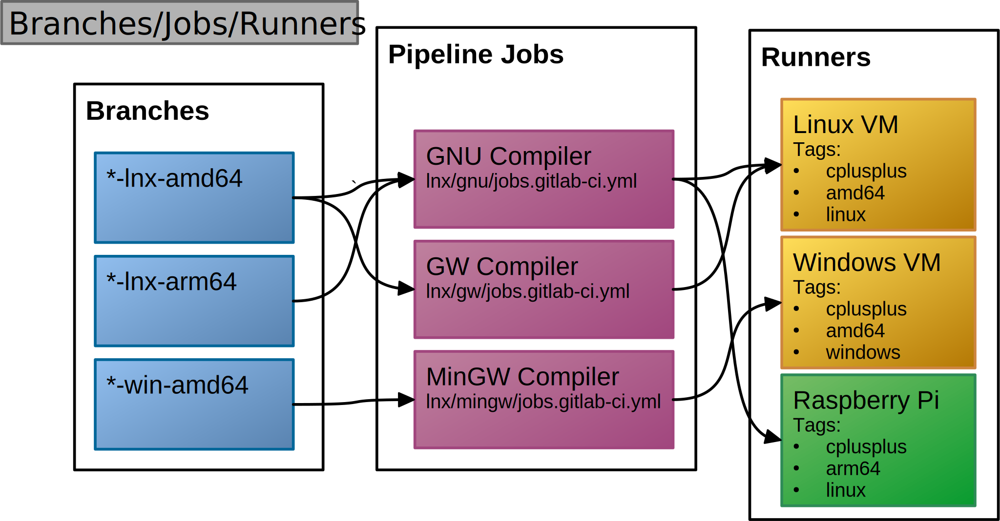

# GitLab DevOps Project {#main}

Generated from code by [Doxygen](https://www.doxygen.nl/) (_[GitHub](https://github.com/doxygen/doxygen.git)_).

View or clone this project from [GitHub](https://github.com/Scanframe/sf-gitlab-devops).

## Markdown Pages

This current page is the main page of the generate HTML pages.
It is a mandatory file in this Doxygen setup.

Open the [README](../README.md) page of this project.
_The reference is relative to the cmake_build_* directory.


### Referencing

Example of referencing namespaced functions:

* ::MySpace::calculateOffset
* ::MySpace::clip


## Images

### LibreOffice

The image below is created using LibreOffice (file: `svg-images.odg`) since it is the 
only cross-platform application able to export SVG well enough.<br>
To get a file like this select all items in the page wit `Ctrl+A` then export the file 
with menu `File | Export` and in the save dialog put a checkmark at **Selection** &#10004; option.
When not, the whole page is put in the resulting SVG-file which means a lot of white space around it.   



### PlantUML

This next SVG image is generated by PlantUML using DoxyGen's PlantUML plugin.
Jar-file is automatically fetched and/or downloaded.

#### Doxygen Style

@startuml BranchesJobsRunners
Bob -> Alice : hello
Alice -> Bob : hi
@enduml

#### GitLab Style

```plantuml
Bob -> Alice : hello
Alice -> Bob : hi
```

